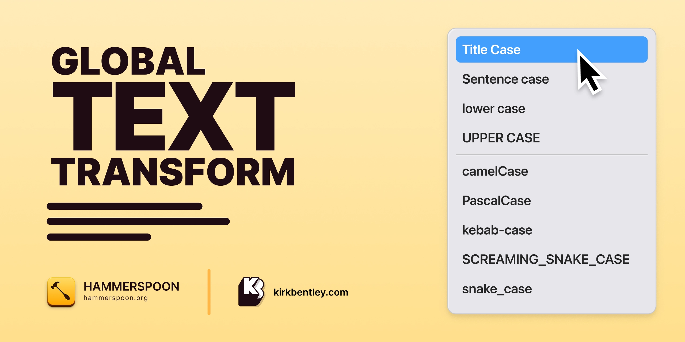

# TextTransform.spoon
Enhance your text manipulation capabilities with a global context menu. This Hammerspoon Spoon lets you to effortlessly transform text strings and offers handy helpers for MarkDown links, MarkDown → Slack MarkDown conversion, and quick Jira links.

## Text Transformations

* Title Case
* Sentence case
* lower case
* UPPER CASE

If you're a developer, the code transform actions will come in handy for quickly converting between various variable casing.

* camelCase
* PascalCase
* kebab-case
* SCREAMING_SNAKE_CASE
* snake_case

## Installing Spoon

The easiest way to install the Text Transform spoon::

```
mkdir -p ~/.hammerspoon/Spoons
git clone git@github.com:fyrebase/TextTransform.spoon.git ~/.hammerspoon/Spoons/TextTransform.spoon
```

## Init Spoon

Add this line to your Hammerspoon `init.lua` file:

```
hs.loadSpoon("TextTransform")
```

### Code Transform - Variable Casing

Add this line to enable the code transformations. They are disabled by default.

```
spoon.TextTransform:addCodeTransforms()
```

### Jira Links

If you are using Jira for your issue and ticket needs you no longer have to find, copy and paste the URL. Knowing the ticket names space and number is enough... transform the text `DESIGN-001` into a full blown URL with a quick key press.

Add the URL to your Jira instance like below to your `init.lua` file. Replace `[REPLACE_WITH_YOUR_JIRA_INSTANCE_URL]` with the URL to your Jira instance.

```
spoon.TextTransform.jiraURL = "https://[REPLACE_WITH_YOUR_JIRA_INSTANCE_URL]/browse/"
```

### MarkDown Links

Convert highlighted text and a URL on your clipboard to a MarkDown link in a flash.

`My Text` + URL on clipboard to `[My Text](https://example.com)`.

### MarkDown → Slack MarkDown

Convert MarkDown from the clipboard to Slack Markdown. Formatting makes a huge difference to the legibility of your message. This feature allows you to quickly convert MarkDown to the Slack equivalant with a simple key combination.

### Add Keyboard Shortcuts

To trigger the Text Transform context menu and the other features above add the following snippet to `init.lua` and assign the key combinations that work for you.

```
spoon.TextTransform:bindHotKeys({
    showTransformContextMenu = {{"ctrl", "shift"}, "down"},
    createMarkDownLink = {{"ctrl", "shift"}, "right"},
    createJiraLink = {{"ctrl", "shift"}, "left"},
    createSlackDownFromMarkDown = {{"ctrl", "shift"}, "up"},
})
```

### Add Mouse + Keyboard Shortcut

Sometimes it's quicker to access the Text Transform context menu without the need to remove your hand from the mouse. Add the following snippet to `init.lua`.

```
hs.eventtap.new({hs.eventtap.event.types.leftMouseDown}, function(event)
    local flags = event:getFlags()
    if flags.ctrl and flags.shift then
        spoon.TextTransform:showTransformContextMenu()
        event:setHandled(true)
    end
end):start()
```